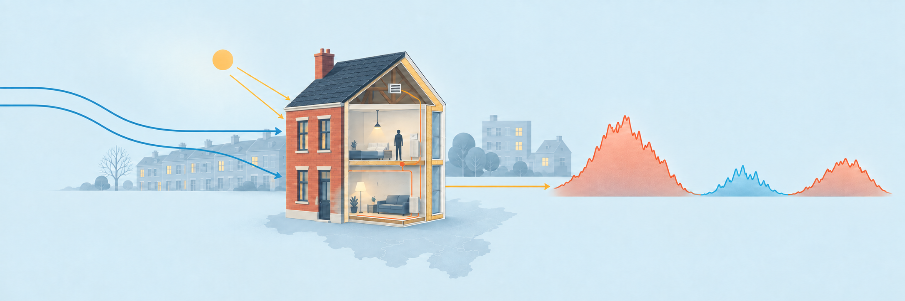
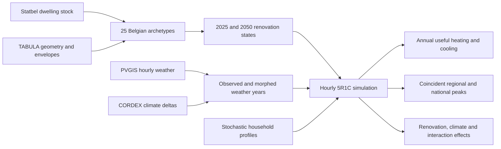

<p align="center">
  
</p>

<h1 align="center">Belgian Residential Thermal Demand</h1>

<p align="center">
  <strong>A bottom-up, hourly model of how renovation, climate change and household behaviour shape Belgium’s residential heating and cooling demand from 2025 to 2050.</strong>
</p>

<p align="center">
  
  
  
  
</p>

---

## What is this?

This repository contains the modelling framework developed to investigate a deceptively simple question:

> How will renovation and a changing climate alter the annual thermal demand and coincident peak loads of Belgium’s residential building stock?

The framework connects official Belgian building-stock data, TABULA dwelling archetypes, a 2025–2050 renovation-state transition, observed and climate-morphed weather, stochastic household profiles, and an hourly single-zone 5R1C thermal model.

It estimates **useful space-heating and sensible-cooling demand**. It does not directly estimate fuel consumption, heat-pump electricity, boiler demand or electrical-network capacity.

## At a glance

| Component | Representation |
|---|---:|
| Modelled residential stock | 5,537,385 dwellings |
| Share of Belgian R1–R6 dwellings represented | 95.0% |
| Physical archetypes | 25 dwelling type–construction period combinations |
| Renovation states | Existing, standard/B proxy and advanced/A proxy |
| Geographic regions | Flanders, Wallonia and Brussels |
| Temporal resolution | Hourly |
| Thermal model | ISO 13790 single-zone 5R1C |
| Observed weather years | 18 PVGIS years, 2006–2023 |
| Future weather ensemble | 54 paired members across RCP2.6, RCP4.5 and RCP8.5 |
| Paired behavioural sample | 160 occupant seeds |
| Projection horizon | 2025–2050 |

## Modelling framework



The counterfactual analysis uses a paired $2\times2$ design:

| Case | Building stock | Weather |
|---|---|---|
| `Q00` | 2025 | Observed reference |
| `Q10` | 2050 | Observed reference |
| `Q01` | 2025 | 2050 climate |
| `Q11` | 2050 | 2050 climate |

Reusing the same weather chronology and occupant seeds across cases isolates renovation, climate and interaction effects while reducing irrelevant Monte Carlo noise.

## Selected results

Under the modelled federal renovation pathway:

- The share of dwellings in the Existing state decreases from **77.3% in 2025 to 35.3% in 2050**.
- Renovation alone reduces annual useful heating by **47.2%** relative to the technical whole-dwelling baseline.
- Climate warming produces an additional heating reduction of approximately **9.7–14.2%**, depending on the retained RCP member.
- Projected-stock/projected-climate (`Q11`) useful heating is **76.42 TWh under RCP2.6**, **76.86 TWh under RCP4.5** and **72.30 TWh under RCP8.5**.
- Coincident useful-heating peaks range from **40.31 to 42.74 GW**.
- Under the retained RCP4.5 chronology, potential useful sensible cooling is approximately **2.7 TWh**.

These are conditional model results, not probabilistic forecasts. Within-RCP weather chronology can create more variation than the separation between the three retained RCP members.

## Repository structure

```text
.
├── BE_building_stock/    # Archetypes, regional weights and renovation states
├── climate/              # PVGIS observations and CORDEX-based climate morphing
├── thermal_model/        # 5R1C core, behaviour and Monte Carlo aggregation
├── scripts/              # Figure, table and thesis-artefact generation
└── figures/              # Generated figures
```

Detailed documentation is available for each modelling layer:

- [Belgian building-stock model](BE_building_stock/docs/BE_BUILDING_STOCK_MODEL.md)
- [Climate ensemble](climate/CLIMATE_ENSEMBLE.md)
- [Thermal core](thermal_model/THERMAL_CORE.md)
- [Verification and validation](thermal_model/GATE3_VERIFICATION_VALIDATION.md)
- [Monte Carlo design](thermal_model/MONTE_CARLO.md)
- [Current-versus-2050 experiment](thermal_model/CURRENT_VS_2050.md)

## Quick start

The audited environment uses Python 3.12. Node.js 20 or newer is required only for the renovation projection scripts.

```bash
python3.12 -m venv .venv
source .venv/bin/activate

python -m pip install --upgrade pip
python -m pip install -r BE_building_stock/requirements-lock.txt
python -m pip install -r climate/requirements.txt
python -m pip install -r thermal_model/behaviour/requirements.txt
```

Run the test suites:

```bash
python -m pytest \
  BE_building_stock/tests \
  climate/tests \
  thermal_model/tests \
  -q
```

Audit the persisted climate ensemble and deterministic thermal model:

```bash
python -m climate.src.validate --config climate/config.yaml
python -m thermal_model.validation
python -m thermal_model.behaviour.coupling
```

Inspect the available weather and model scenarios, then run the bounded pilot:

```bash
python -m thermal_model.monte_carlo catalog
python -m thermal_model.monte_carlo pilot
```

## Rebuilding the modelling layers

### Building stock and renovation projection

```bash
python BE_building_stock/scripts/regional_pipeline.py

cd BE_building_stock
npm ci
npm run renovation
cd ..
```

### Climate ensemble

The climate pipeline requires the raw CORDEX NetCDF inputs declared in `climate/config.yaml`.

```bash
python -m climate.src.prepare_cordex --config climate/config.yaml
python -m climate.src.load_observed --config climate/config.yaml
python -m climate.src.deltas --config climate/config.yaml
python -m climate.src.build_ensemble --config climate/config.yaml
python -m climate.src.validate --config climate/config.yaml
```

### Paired current-versus-2050 experiment

The complete experiment is computationally expensive and uses restartable, authenticated partitions:

```bash
python -m thermal_model.monte_carlo.current_vs_2050 all --max-workers 4
```

See the modelling documents before launching a production run. Pilot output is intended for implementation checks and must not be presented as a stock-level result.

## Reproducibility

The workflow is designed to make scientific assumptions visible and failures explicit:

- Input schemas and physical ranges are validated before simulation.
- Source and derived artifacts carry SHA-256 provenance.
- Weather members preserve complete hourly calendars and UTC alignment.
- Common occupant seeds are reused across paired comparisons.
- Production designs lock their weather inventory, stock weights, scenarios and seed bank.
- Restartable partitions prevent partial runs from being mistaken for complete experiments.
- Coincident peaks are calculated from aggregated hourly profiles; individual dwelling maxima are never summed into a national peak.

## Interpretation and limitations

The results should be read within the declared model boundary:

- A single thermal zone represents each dwelling.
- The 2025 dwelling stock is held fixed; demolition, new construction and changing household totals are outside the current scope.
- Thermal bridges, dynamic window opening, latent cooling and detailed HVAC equipment are excluded.
- The climate ensemble uses one GCM–RCM chain. Its 54 members are paired deterministic weather-year cases, not 54 independent probabilistic samples.
- Heating and cooling are ideal useful thermal loads with unlimited control capacity.
- Cooling represents potential sensible demand under universal ideal control, not expected air-conditioning adoption.
- Thermal peaks cannot be converted directly into electrical-network or generation capacity without technology uptake, efficiencies, cold-hour performance, backup systems and cross-end-use coincidence.

## Principal data sources

- [Statbel cadastral building stock](https://statbel.fgov.be/en/open-data/cadastral-statistics-building-stock-24)
- [Belgian TABULA/VITO scientific report](https://episcope.eu/fileadmin/tabula/public/docs/scientific/BE_TABULA_ScientificReport_VITO.pdf)
- [PVGIS](https://joint-research-centre.ec.europa.eu/photovoltaic-geographical-information-system-pvgis_en)
- [CORDEX data through the Copernicus Climate Data Store](https://cds.climate.copernicus.eu/datasets/projections-cordex-domains-single-levels)

Precise source locators, access dates, checksums and evidence boundaries are recorded alongside the relevant assumptions and generated artifacts.

## Citation

This repository accompanies a master’s thesis at Vrije Universiteit Brussel. Formal citation metadata will be added after publication.

---

<p align="center">
  <em>From weather outside one dwelling to demand across an entire building stock.</em>
</p>
